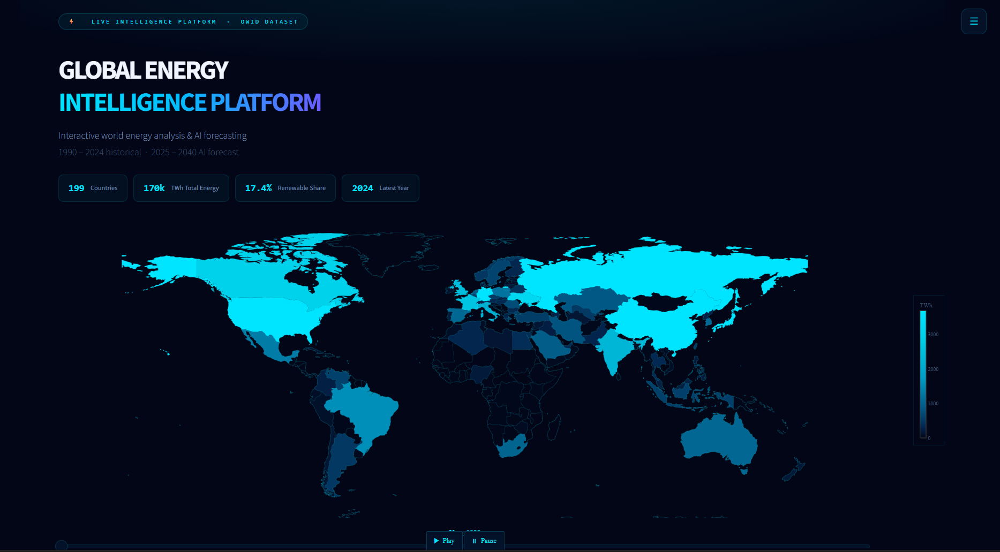
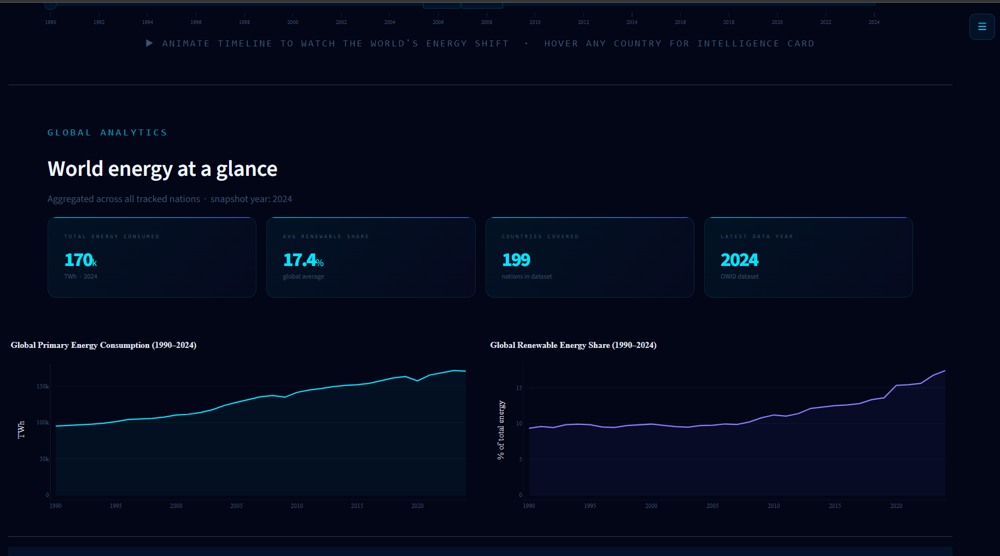
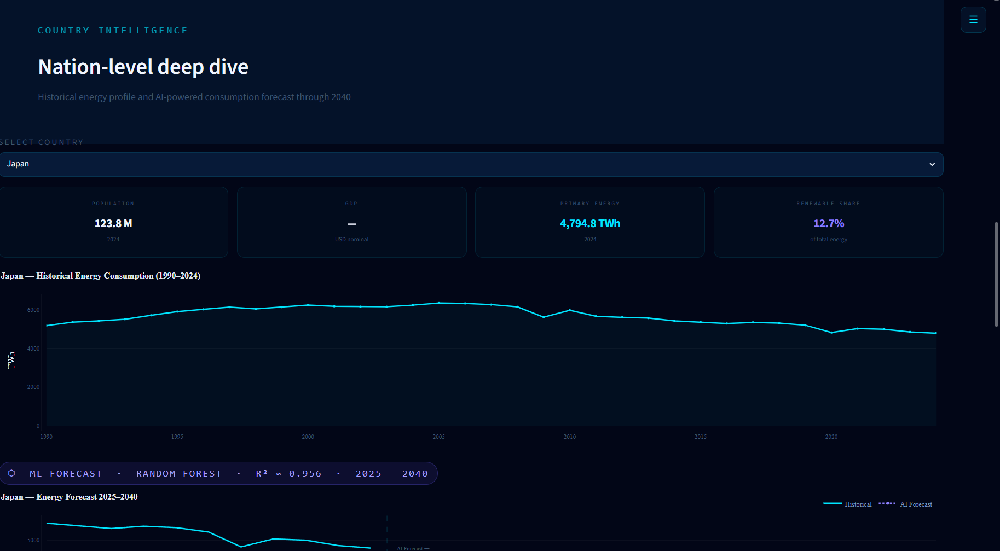
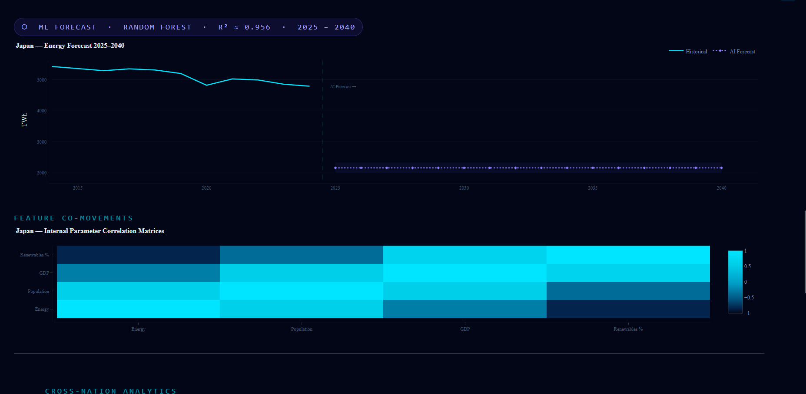
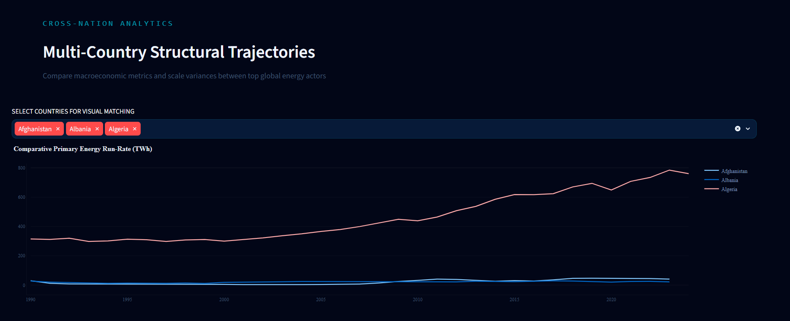
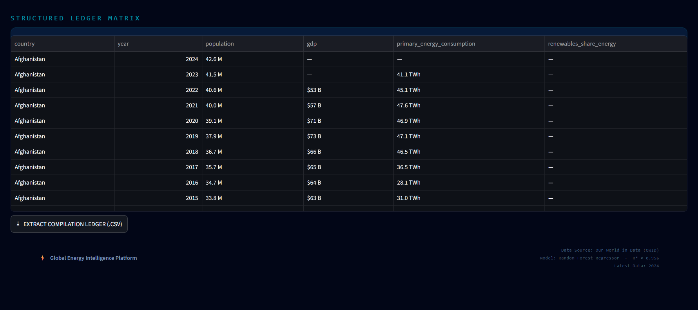

# Global Energy Intelligence Platform

<p align="center">
  
  
  
  
  
  
</p>

<p align="center">
  
  
  
  
</p>

<p align="center">
  <strong>Interactive World Energy Analysis and AI-Powered Forecasting</strong><br/>
  An end-to-end machine learning and analytics platform covering 1990–2024 historical energy data for 130+ countries, with a Random Forest model forecasting national energy consumption through 2040.
</p>

---

## Overview

Global energy transition is one of the defining challenges of the coming decades. Policymakers, researchers, and engineers need tools to understand how countries consume energy, how fast renewable adoption is growing, and how consumption is likely to evolve. Raw datasets exist — Our World in Data's energy dataset covers 130+ countries across 30+ years — but translating that into actionable intelligence requires structured analysis, engineered features, and predictive modelling.

This project builds a complete pipeline from raw OWID data through cleaning, feature engineering, model training, and deployment as an interactive Streamlit dashboard. The result is an intelligence platform that lets users explore historical energy trends globally, drill down to any country, view an AI-generated consumption forecast through 2040, and compare multiple nations side by side — all in a single application.

---

## Key Features

**Animated Global Choropleth Map**
An interactive world map built with Plotly Choropleth renders energy consumption by country with a year-by-year animation from 1990 to the latest available year. Users can play the timeline automatically or scrub through it manually. Hovering over any country surfaces a live intelligence card showing population, GDP, energy consumption, renewable share, and year.

**Global Analytics Panel**
Four headline KPI cards summarise the entire dataset in the latest available year: total energy consumed (TWh), average renewable share, number of countries covered, and the latest data year. Two trend charts — global primary energy consumption and global renewable energy share, both from 1990 to present — provide immediate macro context.

**Country Intelligence — Historical Profile**
Any of the 130+ countries in the dataset can be selected from a dropdown. The selected country's latest-year statistics (population, GDP, primary energy, renewable share) are displayed in stat cards, followed by a historical area chart of consumption from 1990 to the latest available year.

**Country Intelligence — AI Forecast (2025–2040)**
A trained Random Forest Regressor forecasts each selected country's primary energy consumption from 2025 through 2040. The forecast chart shows the last decade of historical data bridging into the predicted trajectory, with an 8% confidence band rendered as a shaded region. When the trained model cannot be loaded, the application falls back to a trend-extrapolation method derived from the recent historical series.

**Parameter Correlation Matrix**
For the selected country, a heatmap displays the Pearson correlation between the four core variables — primary energy consumption, population, GDP, and renewable share — across all available years. This provides a quick structural reading of how closely a country's energy use tracks its economic and demographic growth.

**Cross-Nation Comparison**
A multi-select interface lets users choose any combination of countries and overlay their energy consumption trajectories on a single Plotly line chart. Below the chart, a formatted tabular ledger shows the full historical record for all selected countries. A download button exports the visible data as a CSV file.

**CSV Data Export**
The comparison section includes a direct download of the currently selected countries' historical data in CSV format, enabling offline analysis.

---

## Screenshots

### Hero and Global Intelligence Map


### Global Analytics and Trend Charts


### Country Intelligence — Historical Profile and AI Forecast


### Parameter Correlation Heatmap


### Cross-Nation Comparison and Data Ledger


### Multi-Country Overlay Chart


---

## Machine Learning Workflow

```
1. Data Collection
   └── Our World in Data (OWID) energy dataset
       owid-energy-data.csv — 130+ countries, 1990–2024

2. Data Cleaning  [notebooks/01_data_exploration.ipynb, 02_eda.ipynb]
   ├── Column standardisation
   ├── Year filtering (≥ 1990)
   ├── World aggregate rows excluded
   └── Output: data/clean_energy_data.csv

3. Feature Engineering  [notebooks/03_feature_engineering.ipynb]
   ├── renewable_ratio  = renewables_consumption / primary_energy_consumption
   ├── fossil_ratio     = fossil_fuel_consumption / primary_energy_consumption
   ├── electricity_per_person = electricity_generation / population
   ├── energy_per_gdp_calc    = primary_energy_consumption / gdp
   ├── Inf → NaN replacement
   └── Output: data/engineered_energy_data.csv

4. Model Training  [notebooks/04_model_training.ipynb]
   ├── Features: year, population, gdp, electricity_generation,
   │            electricity_demand, coal_consumption, gas_consumption,
   │            oil_consumption, renewables_consumption,
   │            low_carbon_consumption, greenhouse_gas_emissions,
   │            renewable_ratio, fossil_ratio
   ├── Target: primary_energy_consumption
   ├── Split: 80/20 train/test (random_state=42)
   ├── Models trained: Linear Regression, Random Forest (n_estimators=200)
   └── Best model serialised: models/energy_forecast_model.pkl

5. Evaluation  [notebooks/04_model_training.ipynb]
   └── Metrics: MAE, RMSE, R²

6. Deployment  [app.py]
   └── Streamlit dashboard loads pkl artifact via joblib
       Forecast generated per-country at runtime
```

---

## Dataset

| Property | Details |
|---|---|
| Source | Our World in Data — Energy Dataset |
| Raw file | `data/owid-energy-data.csv` |
| Cleaned file | `data/clean_energy_data.csv` |
| Engineered file | `data/engineered_energy_data.csv` |
| Coverage | 130+ countries, 1990–2024 |
| Target variable | `primary_energy_consumption` (TWh) |

**Core features used in training:**

| Feature | Description |
|---|---|
| `year` | Calendar year |
| `population` | National population |
| `gdp` | Gross domestic product (USD) |
| `electricity_generation` | Total electricity generated (TWh) |
| `electricity_demand` | Total electricity demand (TWh) |
| `coal_consumption` | Coal energy consumption (TWh) |
| `gas_consumption` | Natural gas consumption (TWh) |
| `oil_consumption` | Oil consumption (TWh) |
| `renewables_consumption` | Renewable energy consumed (TWh) |
| `low_carbon_consumption` | Low-carbon energy consumed (TWh) |
| `greenhouse_gas_emissions` | GHG emissions |
| `renewable_ratio` | Engineered: renewables / total energy |
| `fossil_ratio` | Engineered: fossil fuels / total energy |

**Preprocessing applied:**
- Rows with any NaN in training features or target dropped before fitting
- Infinite values replaced with NaN during feature engineering
- No scaling applied (Random Forest is scale-invariant)

---

## Model

| Property | Details |
|---|---|
| Algorithm | Random Forest Regressor |
| Estimators | 200 |
| Training set | 80% of records with complete feature coverage |
| Test set | 20% held out (random_state=42) |
| R² (test) | ≈ 0.956 |
| Serialised as | `models/energy_forecast_model.pkl` |

A Linear Regression baseline was also trained and evaluated in the training notebook for comparison. Random Forest was selected for deployment based on its substantially higher R² on the test set.

**Inference approach in the Streamlit app:**
For each selected country, the app constructs a forward-looking feature table for years 2025–2040 by projecting population (+0.8%/yr), GDP (+2.5%/yr), and renewable share (+0.65 pp/yr) from the last known data point. The trained model predicts consumption for each future year. Output is clamped to ±55% of the last known value to prevent physically implausible extrapolations.

---

## Evaluation

Model performance is measured in the training notebook (`notebooks/04_model_training.ipynb`) using three standard regression metrics:

**MAE (Mean Absolute Error)** — the average absolute deviation between predicted and actual energy consumption across the test set.

**RMSE (Root Mean Squared Error)** — a penalty-weighted error metric that is more sensitive to large deviations, useful for catching cases where the model badly misestimates large consumers.

**R² (Coefficient of Determination)** — the proportion of variance in energy consumption explained by the model. The Random Forest achieves R² ≈ 0.956, indicating the model accounts for over 95% of the variance in the test set.

Feature importance is available from the trained Random Forest via `rf.feature_importances_` and is computed in the training notebook.

---

## Streamlit Dashboard

The application is structured as a single-page scrollable dashboard with four labelled sections and a floating navigation menu accessible from any point on the page.

**Section 1 — Global Intelligence Map**
Hero header with live dataset statistics (country count, total TWh, average renewable share, latest year). Animated Plotly choropleth map of global energy consumption, playable from 1990 to the latest year. Hover tooltips show a per-country intelligence card.

**Section 2 — Global Analytics**
Four KPI cards summarising the latest year's global aggregate. Two side-by-side area charts: global primary energy consumption trend and global average renewable share trend, both spanning the full historical range.

**Section 3 — Country Intelligence**
Country selector dropdown. Four stat cards for the selected country's latest values. Historical energy consumption chart. AI forecast chart spanning 2025–2040 with confidence band. Parameter correlation heatmap for energy, population, GDP, and renewable share.

**Section 4 — Cross-Nation Analytics**
Multi-country selector. Overlaid line chart comparing energy trajectories for all selected countries. Formatted data ledger table. CSV export button.

---

## Project Architecture

```
owid-energy-data.csv
        │
        ▼
┌────────────────────────────────┐
│  01_data_exploration.ipynb     │  Exploratory analysis, missing value audit
│  02_eda.ipynb                  │  Distribution, correlation, trend analysis
└────────────────────────────────┘
        │
        ▼
┌────────────────────────────────┐
│  03_feature_engineering.ipynb  │  Ratio features, inf→NaN, export
│                                │  → data/engineered_energy_data.csv
└────────────────────────────────┘
        │
        ▼
┌────────────────────────────────┐
│  04_model_training.ipynb       │  Linear Regression + Random Forest
│                                │  MAE / RMSE / R² evaluation
│                                │  → models/energy_forecast_model.pkl
└────────────────────────────────┘
        │
        ▼
┌────────────────────────────────┐
│  05_forecasting.ipynb          │  Forecast experiments and validation
└────────────────────────────────┘
        │
        ▼
┌────────────────────────────────┐
│  app.py                        │  Streamlit dashboard
│                                │
│  ├─ Section 1: Animated Map    │
│  ├─ Section 2: Global KPIs     │
│  ├─ Section 3: Country Intel   │
│  │    ├─ Historical chart      │
│  │    ├─ AI Forecast 2025–2040 │
│  │    └─ Correlation heatmap   │
│  └─ Section 4: Comparison      │
│       ├─ Multi-country chart   │
│       ├─ Data ledger table     │
│       └─ CSV export            │
└────────────────────────────────┘
```

---

## Installation

### Prerequisites
- Python 3.10 or higher
- pip

### Setup

```bash
# Clone the repository
git clone https://github.com/devi-chandra/global-energy-intelligence-platform.git
cd global-energy-intelligence-platform

# Create and activate a virtual environment
python -m venv venv
source venv/bin/activate        # macOS / Linux
venv\Scripts\activate           # Windows

# Install dependencies
pip install -r requirements.txt
```

### Run the Notebooks (optional — model already included)

```bash
# Open Jupyter and run notebooks in order
jupyter notebook notebooks/

# 01_data_exploration.ipynb  — EDA
# 02_eda.ipynb               — Extended EDA
# 03_feature_engineering.ipynb
# 04_model_training.ipynb    — Trains and saves the model
# 05_forecasting.ipynb       — Forecast experiments
```

### Launch the Application

```bash
streamlit run app.py
```

The dashboard opens at `http://localhost:8501`. The pre-trained model at `models/energy_forecast_model.pkl` is loaded automatically; running the notebooks is not required to use the app.

---

## Folder Structure

```
global-energy-intelligence-platform/
│
├── data/
│   ├── owid-energy-data.csv             # Raw OWID source dataset
│   ├── clean_energy_data.csv            # Post-cleaning dataset
│   └── engineered_energy_data.csv       # Engineered features (model input)
│
├── models/
│   └── energy_forecast_model.pkl        # Trained Random Forest Regressor
│
├── notebooks/
│   ├── 01_data_exploration.ipynb        # Initial data audit
│   ├── 02_eda.ipynb                     # Distributions, trends, correlations
│   ├── 03_feature_engineering.ipynb     # Feature construction and export
│   ├── 04_model_training.ipynb          # Model training and evaluation
│   └── 05_forecasting.ipynb             # Forecast development
│
├── screenshots/
│   ├── image1.png                       # Hero and choropleth map
│   ├── image2.png                       # Global analytics
│   ├── image3.png                       # Country forecast
│   ├── image4.png                       # Correlation heatmap
│   ├── image5.png                       # Cross-nation comparison
│   └── image6.png                       # Multi-country overlay
│
├── app.py                               # Main Streamlit application
└── requirements.txt
```

---

## Future Improvements

- **Per-Country Model Training** — Train separate models for each major country rather than a single global model, capturing country-specific consumption dynamics more accurately.
- **Extended Feature Set** — Incorporate additional OWID columns (carbon intensity, nuclear share, per-capita metrics) to improve forecast accuracy at the national level.
- **SHAP Explainability** — Add per-prediction SHAP waterfall charts in the Country Intelligence section to surface which features are driving each country's forecast.
- **Sector-Level Breakdown** — Where OWID data permits, disaggregate consumption by sector (industry, transport, residential) for richer country profiles.
- **Cloud Deployment** — Deploy to Streamlit Community Cloud or AWS for public access without local setup.
- **Automated Data Refresh** — Script periodic pulls from the OWID data repository to keep the dashboard current with newly released annual data.

---

## Why This Project Stands Out

Most energy data science projects stop at exploratory analysis or a standalone Jupyter notebook. This project goes further: from raw data through a reproducible multi-notebook pipeline, feature engineering, model training, and a production-quality Streamlit application with a custom UI that would not look out of place in an industry tool.

| Skill | How It Appears in This Project |
|---|---|
| Machine Learning | Random Forest Regressor trained on 13 features; Linear Regression baseline; R² ≈ 0.956 |
| Feature Engineering | Four derived ratio and per-capita features constructed from raw columns |
| Data Engineering | Three-stage data pipeline: raw → clean → engineered; consistent file naming and notebook order |
| Time Series Forecasting | Country-level forward projection 2025–2040 with physically bounded clamping |
| Data Visualisation | Animated choropleth, area charts, correlation heatmap, multi-country overlays — all in Plotly |
| Deployment | Streamlit app with custom CSS design system, floating navigation, responsive layout |
| Production Mindset | Graceful fallback when model file is missing; demo data fallback when CSV is absent; clean separation of data, models, notebooks, and app |

---

## Author

**J Devi**
Final Year B.Tech — Computer Science & Engineering (Artificial Intelligence & Data Science)

LinkedIn: https://linkedin.com/in/jdevi23

---

<p align="center">
  Data Source: <a href="https://ourworldindata.org/energy">Our World in Data — Energy Dataset</a><br/>
  Built with Python · Scikit-Learn · Streamlit · Plotly · Pandas · NumPy · Joblib
</p>
